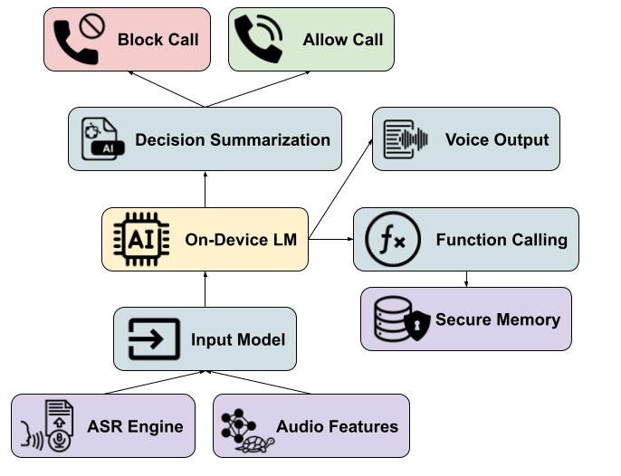

# SwiftFake: Real-time Defense against Spam Robocalling

This site is the page for all information and updates about my Master's Capstone SwiftFake, which aims to build a real-time defense against robocall attacks that utilize Adversarial Cloning or "Deepfakes".

## History

Our lab previously won the FTC Voice Cloning Challenge award for the paper [AntiFake](https://github.com/WUSTL-CSPL/AntiFake?tab=readme-ov-file), which focused on preventing a user's voice recording from being deepfaked by training perturbations optimized against the loss functions of popular voice deepfake encoders like RTVC. Due to this paper, our lab consulted with The White House in 2024 about how to prevent the spread of deepfakes. While this existing work was promising, it lacked scalability in the mobile domain- requiring an Nvidia GPU with at least 8 GB of VRAM, took a lot of time to run, and needed a complete audio clip to train effective perturbations. 

SwiftFake started as an engineering project to defend a user's voice from being deepfaked in real-time. I identified a gap in literature where there had been a significant lack of engineering work exploring performance, with most of the existing work running models on high-power GPUs that draw 15-40x the power of a smartphone and lacked scalability. I started by porting encoders to work with CoreML in iOS and building a hook to record a user's audio and pass it through the encoder so we could use a trained model to inject perturbations.

After some discussion internally about how realistic the threat model for this scenario was, I pivoted the project to focus more on the real-time defense against AI-generated robocalls rather than focusing on the defense of a user's voice against being cloned.

## Motivation and Background

Spam robocalling remains a prominent threat, with YouMail reported that Americans received 4.7 billion spam calls in November 2024 alone, and 1 in 5 Americans reporting losing money to spam calls. The failures of network defense mechanisms like the SHAKEN/STIR protocol against spam means that an ideal defense must happen at the spam call itself. 

## System Design

We design an LLM-based system utilizing an on-device Language model that can pick up a phone call and screen it for up to 40 seconds. In this time, it can talk to the other party to ask questions, it can call into memory to retrieve facts. A decision summarization engine govern's the model's execution and will execute the model's verdict to block or allow a call. If a decision isn't reached soon enough, it will summarize the model's reasoning. A block diagram is shown below

In early experiments, we identified a high false positive rate of calls being screened, an issue mirrored across other spam filtering systems. We resolve this system by creating secure memory, a way for the model to access sensitive context without exposing the information to the other caller.

## Resources and Media

<a href="support/SwiftFake_MS_Presentation.pdf">Master's Defense Slides</a>

<a href="support/SwiftFake_Report.pdf">Master's Project Report</a>

I defended my Master's project SwiftFake on December 13th, 2024. I unfortunately did not make a recording of the defense, but the slides are here.

There are currently plans for the project to be continued and submitted to USENIX 2025, and I will update this section as anything progresses.

## Acknowledgements and Thanks

### People:
- Dr. Ning Zhang, PI
- Collaborators: Ching-Hsiang Chan, Yuanahar Chang
- Project Defense Reviewers (Dr. Patrick Crowley, Dr. Nathan Jacobs)

### Software:
- LLM Models: Microsoft Phi 3, Llama 3.1/3.2, Google Gemma, lucifer (jailbroken llama fork)
- Open-Source Software: ffmpeg, ollama, SpeechRecognition, CMU Sphinx, pandas, sox
- Datasets: TalkBank phone datasets, robocall-audio-dataset, FTC

